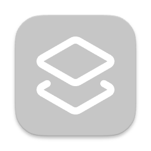

# EasyCopy

  


EasyCopy is a macOS menu bar Electron app for saving links and copying them quickly.

I came up with this idea because I was constantly having to go to my browser search bar and type in the first few characters of URLs just to trigger autocomplete so I could copy/paste a url that I needed.

## Install

```bash
npm install
```

## Use the app

### Option 1: Download from GitHub Releases

Download the latest `.dmg` from the repository's **Releases** page and install EasyCopy.

### Option 2: Build it yourself (macOS)

Build a distributable `.dmg` and `.zip`:

```bash
npm run build-mac
```

Output files are written to `dist/`.

## Run locally (development)

Start the app:

```bash
npm start
```

`npm start` builds Electron TypeScript (`main` + `preload`) and the React/Tailwind renderer before launching Electron.

## Features

- macOS menu bar app named **EasyCopy**
- Add named links
- Copy a link with one click
- Delete links
- Persistent storage in your local Electron user data folder
- Quick-copy entries in the tray context menu
- TypeScript-based Electron code (`main` + `preload`)
- React renderer
- Tailwind CSS styling
